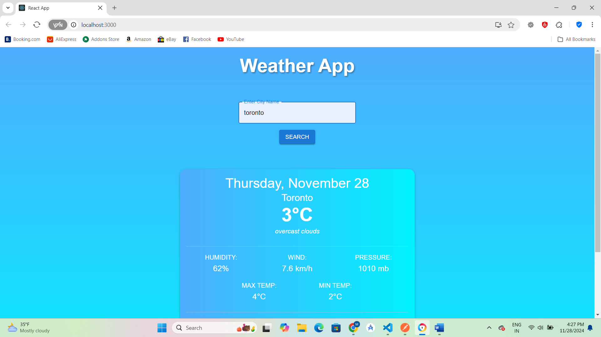
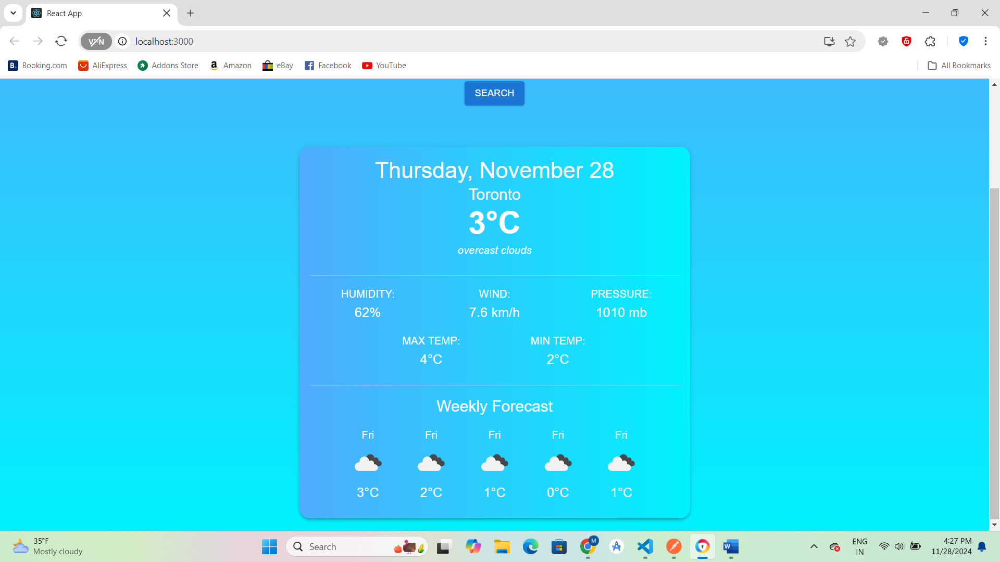
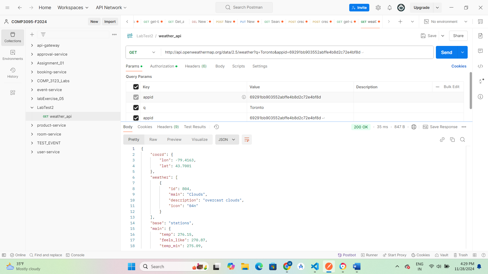

# Weather App - COMP3123 Lab Test 2

## Overview
This Weather App is a simple and intuitive application that fetches real-time weather data from the OpenWeatherMap API. It allows users to search for the current weather conditions in any city worldwide, providing essential details such as temperature, humidity, and a visual weather condition icon.

This project demonstrates practical skills in:

ReactJS development.
Integration of external APIs.
Responsive and user-friendly UI design.
Error handling for better user experience.

## **Features**
- 🌍 **Search Weather by City**: Enter the name of any city, and the app fetches its current weather conditions.
- 🌡️ **Real-Time Weather Data**:
  - Displays **temperature**, **humidity**, and a **weather condition icon**.
  - Provides a clean and aesthetic layout for readability.
- ⚠️ **Error Handling**:
  - If an invalid city name is entered, the app displays a friendly error message (e.g., "City not found").
  - Handles API-related errors promptly and ensures the app doesn't crash.
- ✅ **POSTMAN Testing**: The weather API endpoints have been successfully tested using POSTMAN to verify the correctness of the API responses.
- 📱 **Responsive Design**:
  - Ensures the app looks good on desktops, tablets, and mobile devices.

## Installation
1. Clone the repository.
2. Run `npm install` to install dependencies.
3. Add your API key to a `.env` file.
4. Run `npm start` to start the app.
- Runs the app in the development mode.
- Open http://localhost:3000 to view it in your browser.

#Project Output

### Current Weather

### Postman Testing 

